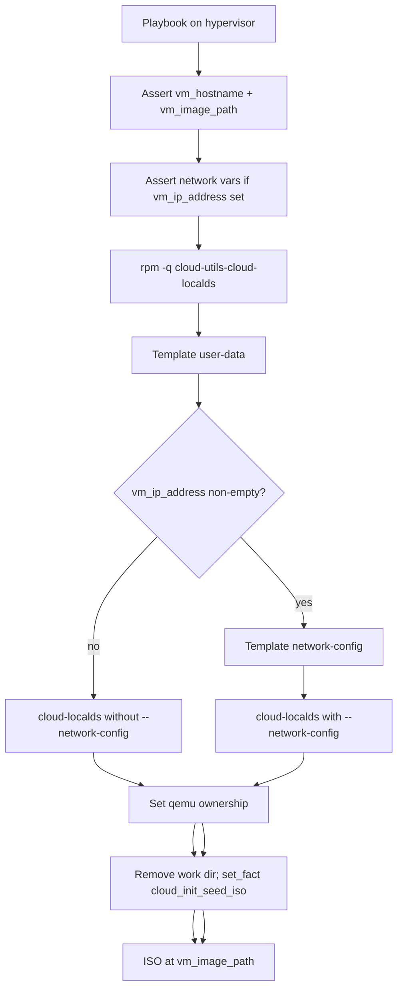

# generate-cloud-init-iso role

Ansible role that renders cloud-init templates on a hypervisor and runs `cloud-localds` to produce a per-VM seed ISO at `{{ vm_image_path }}{{ vm_hostname }}-seed.iso`.

Use it before [`libvirt-newvm.yml`](libvirt-newvm.yml) when you need a dedicated seed ISO — either DHCP (user-data only) or static IP (user-data plus network-config).

## Prerequisites

- `cloud-utils-cloud-localds` pre-installed in the hypervisor bootc image. The role checks with `rpm -q` and fails fast; it does not install packages.
- [`vars/vm_image.yml`](vars/vm_image.yml) loaded by the caller to supply `vm_image_path` (currently `/mnt/vm_images/`).
- [`defaults/main.yml`](defaults/main.yml) loaded for `vm_domain` and network variable defaults.
- For static IP: the VM MAC address. This is a chicken-and-egg problem — define the domain first (even without starting it) and read the MAC from `virsh dumpxml`, or set it explicitly if you control the libvirt XML.

## How it works



All tasks run on the inventory host (the hypervisor), not on `localhost`.

## Role layout

| Path | Purpose |
|------|---------|
| [`roles/generate-cloud-init-iso/defaults/main.yml`](roles/generate-cloud-init-iso/defaults/main.yml) | Output path, filename, work dir, ownership, package/binary names |
| [`roles/generate-cloud-init-iso/tasks/main.yml`](roles/generate-cloud-init-iso/tasks/main.yml) | Validation, template render, ISO generation, cleanup |
| [`roles/generate-cloud-init-iso/templates/cloud_init_user_data.cfg.j2`](roles/generate-cloud-init-iso/templates/cloud_init_user_data.cfg.j2) | Hostname, users, qemu-guest-agent |
| [`roles/generate-cloud-init-iso/templates/cloud_init_network_config.cfg.j2`](roles/generate-cloud-init-iso/templates/cloud_init_network_config.cfg.j2) | Network Config v2 (static IP only) |

The role templates are the canonical source. Repo-root `templates/cloud_init_*.j2` copies no longer exist.

## Variables

### Always required

| Variable | Source |
|----------|--------|
| `vm_hostname` | Caller (`-e` or playbook vars) |
| `vm_image_path` | [`vars/vm_image.yml`](vars/vm_image.yml) |

### From repo defaults

Defined in [`defaults/main.yml`](defaults/main.yml); override with `-e` as needed.

| Variable | Default | Notes |
|----------|---------|-------|
| `vm_domain` | `{{ ansible_hostname }}.blasco.id.au` | FQDN suffix and DNS search domain |
| `vm_ip_address` | `''` | Empty = DHCP; no network-config volume injected |
| `vm_mac_address` | `''` | Required when `vm_ip_address` is non-empty |
| `vm_ip_prefix` | `'24'` | CIDR prefix length (e.g. `22`) |
| `vm_ip_gateway` | `''` | Required when `vm_ip_address` is non-empty |
| `vm_ip_nameservers` | `[]` | YAML list; required when `vm_ip_address` is non-empty |

When `vm_ip_address` is non-empty, the role asserts that `vm_mac_address`, `vm_ip_gateway`, and `vm_ip_nameservers` are all set.

### Role defaults

Defined in [`roles/generate-cloud-init-iso/defaults/main.yml`](roles/generate-cloud-init-iso/defaults/main.yml).

| Variable | Default |
|----------|---------|
| `generate_cloud_init_iso_filename` | `{{ vm_hostname }}-seed.iso` |
| `generate_cloud_init_iso_dest` | `{{ vm_image_path }}{{ generate_cloud_init_iso_filename }}` |
| `generate_cloud_init_work_dir` | `/tmp/ansible-cloud-init-{{ vm_hostname }}` |
| `generate_cloud_init_iso_owner` / `group` | `qemu` |
| `generate_cloud_init_iso_mode` | `0644` |
| `generate_cloud_init_package` | `cloud-utils-cloud-localds` |
| `generate_cloud_init_command` | `cloud-localds` |

### Facts set by the role

| Fact | Value |
|------|-------|
| `cloud_init_seed_iso` | Generated filename (for chaining into `libvirt-newvm.yml`) |
| `generate_cloud_init_iso_path` | Full path on the hypervisor |

## Usage

The example playbook is [`generate-cloud-init-seed.yml`](generate-cloud-init-seed.yml). It loads both `vars/vm_image.yml` and `defaults/main.yml`.

### DHCP / no static IP

Network-config is not injected. The seed ISO contains user-data only.

```bash
ansible-playbook generate-cloud-init-seed.yml --ask-become-pass \
  -e hypervisor_host=nuc.lan \
  -e vm_hostname=my-rhis-vm
```

### Static IP

Network-config is rendered and passed to `cloud-localds` via `--network-config`.

```bash
ansible-playbook generate-cloud-init-seed.yml --ask-become-pass \
  -e hypervisor_host=nuc.lan \
  -e vm_hostname=my-rhis-vm \
  -e vm_ip_address=192.168.140.99 \
  -e vm_ip_prefix=22 \
  -e vm_ip_gateway=192.168.140.1 \
  -e 'vm_ip_nameservers=["192.168.1.3","192.168.1.7"]' \
  -e vm_mac_address=52:54:00:af:bd:e4
```

**Nameservers quoting:** use the JSON array form shown above. Ansible's `-e key=value` syntax does not YAML-parse the value, so `-e 'vm_ip_nameservers=[192.168.1.3, 192.168.1.7]'` passes a literal string and the template will iterate it character by character. The role template includes a `from_yaml` coercion as a safety net, but the JSON form is the correct invocation.

### Chain into VM creation

```bash
ansible-playbook libvirt-newvm.yml --ask-become-pass \
  -e hypervisor_host=nuc.lan \
  -e vm_hostname=my-rhis-vm \
  -e cloud_init_seed_iso=my-rhis-vm-seed.iso \
  -e vm_host_network=vm-network-vlan140
```

The role's `set_fact` sets `cloud_init_seed_iso` automatically, so you can run both playbooks in sequence without repeating the filename if you register the fact (same play) or pass it explicitly (separate runs).

For VLAN 140 host networking context, see [`README.rhis-networking.md`](README.rhis-networking.md). That document's note that seed ISOs do not configure guest networking is superseded by this role when `vm_ip_address` is set.

## Idempotency

The role skips `cloud-localds` when the seed ISO already exists and neither template changed. To force regeneration, delete the ISO on the hypervisor or change a variable that affects template output.

## Customization

- Edit the role templates to change user accounts, packages, or network layout.
- Override role defaults (e.g. a custom filename) via playbook `vars` or `-e`.
- The user-data template contains site-specific SSH keys and passwords. Review before use outside this environment.

The user-data template configures:

- Hostname and FQDN from `vm_hostname` and `vm_domain`
- Users `bblasco` and `ansiblerunner` with sudo, SSH keys, and plaintext passwords
- `qemu-guest-agent` enabled via `runcmd`
- Root password via `chpasswd`

The network-config template uses Network Config v2 with MAC matching, static address, `gateway4`, and nameservers.

## Troubleshooting

### Inspect the seed ISO on the hypervisor

List volumes inside the ISO:

```bash
isoinfo -f -i /mnt/vm_images/my-rhis-vm-seed.iso
```

Mount and read the network config (DHCP-only ISOs will not have a `network-config` volume):

```bash
sudo mount -o loop /mnt/vm_images/my-rhis-vm-seed.iso /mnt
cat /mnt/network-config    # static IP only
cat /mnt/user-data
sudo umount /mnt
```

### Find the VM MAC address

```bash
virsh dumpxml my-rhis-vm.nuc.lan.blasco.id.au | grep -i mac
```

### Check cloud-init on the guest

```bash
cloud-init status --long
journalctl -u cloud-init-local.service -b
ip -br addr show
nmcli device status
```

### `Address default is not a valid ip address` / `init-local` failure

**Symptom:** cloud-init fails during `init-local`; the guest NIC stays unconfigured. Journal shows both `Address default is not a valid ip address` and `Address default is not a valid ip network`.

**Cause:** `routes: - to: default` in network-config. Cloud-init 24.4 on RHEL (e.g. 10.1) parses Network Config v2 through its own parser before handing off to NetworkManager. It requires `to` to be a real IP/CIDR, not the netplan keyword `default`.

**Fix:** use `gateway4:` instead of `routes: - to: default`. The current role template already does this. If you have an older seed ISO with the broken syntax:

1. Regenerate the seed ISO with the role.
2. On the guest (as root): `cloud-init clean --logs && reboot`
3. Verify: `cloud-init status --long` should report `status: done`; `ip -br addr show ens2` should show the configured address.

No VM recreation is needed if the seed ISO is still attached as a CD-ROM (`/dev/sr0`).

Alternative valid syntax if you prefer routes: `routes: - to: 0.0.0.0/0`.

### Nameservers render as individual characters

**Symptom:** network-config contains one nameserver entry per character (`- '['`, `- '1'`, etc.).

**Cause:** `-e 'vm_ip_nameservers=[1.2.3.4, 1.2.3.5]'` passes a string, not a YAML list.

**Fix:** use the JSON-quoted form: `-e 'vm_ip_nameservers=["192.168.1.3","192.168.1.7"]'`.

### Package missing on hypervisor

```bash
rpm -q cloud-utils-cloud-localds
```

Must be present in the bootc image. The role will not install it.

### Apply an updated seed ISO to a running VM

Regenerate the ISO on the hypervisor, then on the guest:

```bash
cloud-init clean --logs
reboot
```

## Related files

| File | Purpose |
|------|---------|
| [`generate-cloud-init-seed.yml`](generate-cloud-init-seed.yml) | Example playbook calling the role |
| [`libvirt-newvm.yml`](libvirt-newvm.yml) | Consumes `cloud_init_seed_iso` as a CD-ROM volume |
| [`defaults/main.yml`](defaults/main.yml) | Network variable defaults and `vm_domain` |
| [`vars/vm_image.yml`](vars/vm_image.yml) | `vm_image_path` and QCOW2 image catalogue |
| [`README.rhis-networking.md`](README.rhis-networking.md) | VLAN 140 host networking |
| [`README.md`](README.md) | General VM playbook usage |

The cloud-init section in [`README.md`](README.md) is stale (manual `cloud-localds` workflow, incorrect seed path). Use this document instead.
