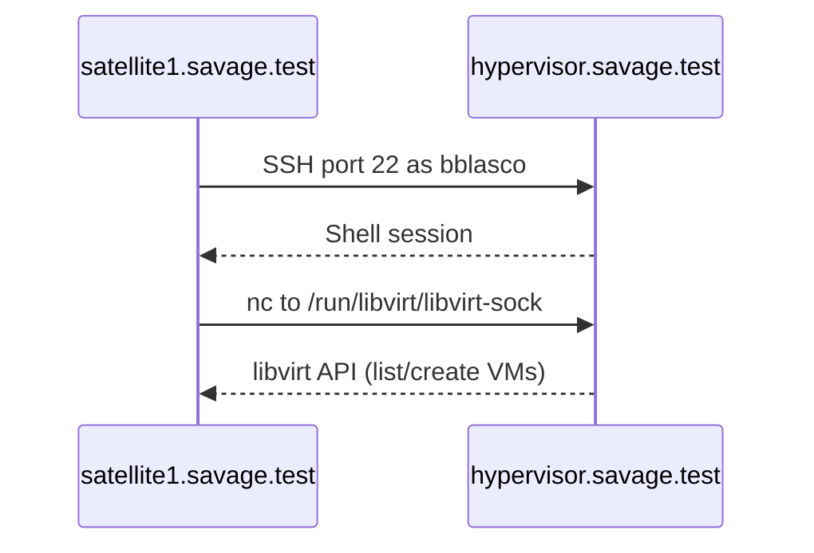

# Red Hat Satellite KVM compute resources

Summary of configuring Red Hat Satellite (`satellite1.savage.test`) to provision and manage VMs on home-lab libvirt hypervisors via `qemu+ssh` (July 2026).
Written by Cursor based on conversation about troubleshooting initial TLS based configuration

## Goal

Register nuc.lan, opti.lan, and hex.lan as Satellite **Libvirt** compute resources so hosts can be provisioned and existing VMs can be listed and managed from Satellite.

Each hypervisor is reachable from Satellite as `<hostname>.savage.test` (e.g. `nuc.savage.test`).

## Architecture

Satellite connects to each hypervisor over **SSH**, not libvirt TLS. The `foreman` user on Satellite SSHs in as `bblasco`, and libvirt uses netcat to reach the local system socket.




| Component           | Role                                                                        |
| ------------------- | --------------------------------------------------------------------------- |
| Satellite Server    | `satellite1.savage.test` — runs Foreman, holds compute resource definitions |
| `foreman` user      | Owns SSH keys and runs `virsh`/Fog libvirt calls on Satellite               |
| `bblasco` user      | SSH login on each hypervisor; member of `libvirt` group                     |
| `virtqemud`         | QEMU driver daemon (must be running on hypervisor)                          |
| `virtproxyd.socket` | Local libvirt API socket at `/run/libvirt/libvirt-sock`                     |


## Hypervisor mapping


| Host     | Satellite DNS    | Compute resource URL                         |
| -------- | ---------------- | -------------------------------------------- |
| nuc.lan  | nuc.savage.test  | `qemu+ssh://bblasco@nuc.savage.test/system`  |
| opti.lan | opti.savage.test | `qemu+ssh://bblasco@opti.savage.test/system` |
| hex.lan  | hex.savage.test  | `qemu+ssh://bblasco@hex.savage.test/system`  |


Use the hostname that resolves correctly from Satellite consistently in both SSH key setup and the compute resource URL.

Libvirt network details per host are in `[host_vars/<host>/stackhpc-libvirt-host.yml](host_vars/nuc.lan/stackhpc-libvirt-host.yml)`.

## Problem encountered

Initial Satellite configuration used `qemu+tls://` (TCP port **16514**). Satellite reported:

```text
Error making a connection to libvirt URI qemu+tls://nuc.savage.test/system:
Call to virConnectOpen failed: unable to connect to server at 'nuc.savage.test:16514':
Connection refused
```

Opening port 16514 in firewalld did not fix this. Investigation showed:


| Check                     | Finding                              |
| ------------------------- | ------------------------------------ |
| TCP 16514 listening       | No listener on any hypervisor        |
| `virtproxyd-tls.socket`   | Disabled and inactive                |
| `/etc/pki/libvirt/`       | Not present — no TLS certificates    |
| SSH port 22               | Listening                            |
| `virtqemud`, `virtproxyd` | Running (required for SSH transport) |


**Root cause:** TLS remote access was never enabled on the hypervisors. Firewalld was not blocking the connection; nothing was accepting it.

## Solution implemented

Switched all three compute resources to `qemu+ssh://`, matching [Satellite 6.19 KVM provisioning](https://docs.redhat.com/en/documentation/red_hat_satellite/6.19/html/provisioning_hosts/provisioning_virtual_machines_on_kvm_kvm-provisioning) and the existing pattern in `[test.yml](test.yml)`.

### Why `qemu+ssh` instead of `qemu+tls`

- Documented default for Satellite KVM compute resources
- No PKI or `virtproxyd-tls.socket` setup on hypervisors
- Uses existing SSH access (port 22) instead of port 16514


### Why `bblasco`, not `root`

Root SSH login is disabled on the hypervisors. Satellite supports non-root provisioning users when they are in the `libvirt` group.

### Why not the `qemu` system account


| Requirement     | `qemu`                             | `bblasco`          |
| --------------- | ---------------------------------- | ------------------ |
| Login shell     | `/usr/sbin/nologin` — SSH rejected | `/bin/bash`        |
| `libvirt` group | No                                 | Yes                |
| Intended use    | Runs VM processes                  | Admin / automation |


The `qemu` account cannot SSH and is the wrong identity for remote libvirt API access.

## Satellite Server configuration

Applied on `satellite1.savage.test`.

### 1. Install libvirt client (not required as already present)

```bash
satellite-maintain packages install libvirt-client
```


### 2. SSH keys for the `foreman` user

For each hypervisor:

```bash
su foreman -s /bin/bash
ssh-keygen          # once, if no key exists
ssh-copy-id bblasco@nuc.savage.test
ssh-copy-id bblasco@opti.savage.test
ssh-copy-id bblasco@hex.savage.test
exit
```


### 3. Verify libvirt over SSH

```bash
su foreman -s /bin/bash -c 'virsh -c qemu+ssh://bblasco@nuc.savage.test/system list --all'
su foreman -s /bin/bash -c 'virsh -c qemu+ssh://bblasco@opti.savage.test/system list --all'
su foreman -s /bin/bash -c 'virsh -c qemu+ssh://bblasco@hex.savage.test/system list --all'
```

Each command must list VMs without error.

### 4. Compute resources in Satellite UI

For each hypervisor (**Infrastructure → Compute Resources**):

- **Provider:** Libvirt
- **URL:** `qemu+ssh://bblasco@<hostname>.savage.test/system`
- Remove any TLS/CA certificate settings from the previous `qemu+tls` attempt
- **Test Connection** — must succeed
- VM list must load without "error listing VMs"

Example Hammer update:

```bash
hammer compute-resource update --name "<resource_name>" \
  --url "qemu+ssh://bblasco@nuc.savage.test/system"
```


## Hypervisor prerequisites

No libvirt daemon changes were required for SSH transport. On each of nuc.lan, opti.lan, and hex.lan:

- `bblasco` is in the `libvirt` group (`groups bblasco` includes `libvirt`)
- `virtqemud.service` is enabled and running
- `virtproxyd.socket` is active (local socket)
- `nc` (netcat) is available for the SSH transport
- `sshd` allows public-key login for `bblasco` from Satellite
- Libvirt networks and storage pools configured via `[config-libvirt-hpc.yml](config-libvirt-hpc.yml)`

Hypervisor libvirt config is applied with:

```bash
ansible-playbook config-libvirt-hpc.yml --limit nuc.lan,opti.lan,hex.lan
```


## Related vm-management files


| File                                                                                   | Relevance                                                  |
| -------------------------------------------------------------------------------------- | ---------------------------------------------------------- |
| `[config-libvirt-hpc.yml](config-libvirt-hpc.yml)`                                     | Libvirt networks, storage pools, hypervisor baseline       |
| `[host_vars/*/stackhpc-libvirt-host.yml](host_vars/nuc.lan/stackhpc-libvirt-host.yml)` | Per-host libvirt network IP ranges                         |
| `[test.yml](test.yml)`                                                                 | Local Ansible libvirt tests using `qemu+ssh://bblasco@...` |
| `[libvirt-newvm.yml](libvirt-newvm.yml)`                                               | VM creation on hypervisors                                 |
| `[generate-cloud-init-seed.yml](generate-cloud-init-seed.yml)`                         | Cloud-init seed ISO for provisioned VMs                    |


## Verification checklist

- [x] `virsh -c qemu+ssh://bblasco@<host>.savage.test/system list --all` works as `foreman` on Satellite
- [x] Satellite compute resource **Test Connection** succeeds for nuc, opti, and hex
- [x] VM list appears in Satellite without connection errors


## Troubleshooting


| Symptom                                         | Likely cause                                                                                     |
| ----------------------------------------------- | ------------------------------------------------------------------------------------------------ |
| Connection refused on port 16514                | Compute resource still uses `qemu+tls://` — change to `qemu+ssh://`                              |
| Permission denied (publickey)                   | `ssh-copy-id` not run for `bblasco`, or key not in `~foreman/.ssh/authorized_keys` on hypervisor |
| Host key verification failed                    | Add hypervisor host key to `foreman` user's `~/.ssh/known_hosts` on Satellite                    |
| Connection timed out                            | Firewall or routing between Satellite and hypervisor on port 22                                  |
| Cannot connect to hypervisor after SSH succeeds | `bblasco` not in `libvirt` group, or `virtqemud`/`virtproxyd` not running                        |
| authentication unavailable: no polkit agent     | Provisioning user lacks `libvirt` group membership                                               |


## Optional: TLS (`qemu+tls`) in the future

If TLS is preferred later (no SSH hop), each hypervisor would need:

1. x509 certificates under `/etc/pki/libvirt/`
2. `systemctl enable --now virtproxyd-tls.socket`
3. CA certificate imported into the Satellite compute resource
4. Firewalld `libvirt-tls` service (port 16514) — see `[firewall.yml](firewall.yml)`

This was not implemented; SSH transport is in use and working.

## References

- [Satellite 6.19 — Provisioning virtual machines on KVM (libvirt)](https://docs.redhat.com/en/documentation/red_hat_satellite/6.19/html/provisioning_hosts/provisioning_virtual_machines_on_kvm_kvm-provisioning)
- [RHEL 9 — libvirt remote access (SSH vs TLS)](https://docs.redhat.com/en/documentation/red_hat_enterprise_linux/9/html/configuring_and_managing_virtualization/migrating-virtual-machines_configuring-and-managing-virtualization)
- [libvirt remote support](https://libvirt.org/remote.html)

